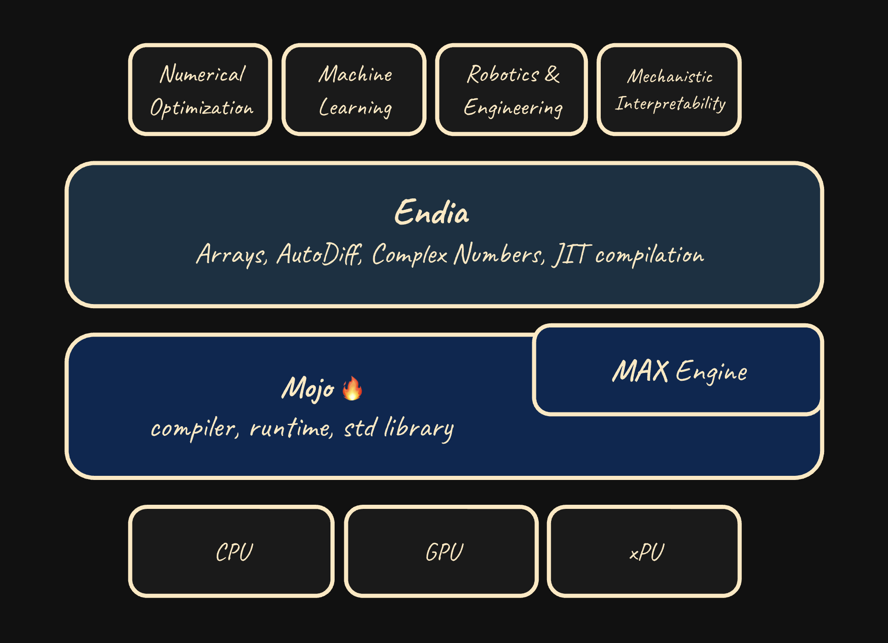

# Welcome to Endia 24.6

**Endia** is a dynamic Machine Learning Library, featuring:

- **Algorithmic Differentiation**: Compute derivatives of arbitrary order for training Neural Networks and beyond.
- **Signal Processing:** Complex Numbers, Fourier Transforms, Convolution, and more.
- **JIT Compilation:** Leverage the [MAX Engine](https://www.modular.com/) to speed up your code.
- **Dual API:** Choose between a PyTorch-like imperative or a JAX-like functional interface.

<!-- <div align="center">
  
  [Website] | [Docs] | [Getting Started]

  [Website]: https://endia.vercel.app/
  [Docs]: https://endia.vercel.app/docs/array
  [Getting Started]: https://endia.vercel.app/docs/get_started

</div> -->

Checkout the [Endia documentation](https://endia.vercel.app/docs/array) for more information.

## Usage

**Prerequisites: [Mojo 24.6](https://docs.modular.com/mojo/manual/get-started) 🔥**

### Option 1: Install the package for usage in your project
- **Add the Endia Package at the top level of your project:**

    ```shell
    curl -o "endia.📦" https://raw.githubusercontent.com/endia-ai/Endia/main/endia.mojopkg
    ```

    <!-- > *But what about **all the other internal dependencies**? - Good news, **there are none**. The core of Endia is built [purely on top of Mojo and MAX](#why-another-ml-framework)!* -->


### Option 2: Clone the repository and run all examples, tests and benchmarks

- **Clone the Repository**

    ```shell
    git clone https://github.com/endia-ai/Endia.git
    cd Endia
    magic shell
    ```

- **Run the Examples, Tests and Benchmarks**

    ```shell
    mojo run_all.mojo
    ````

    Recommended: Go to the `run_all.mojo` file and adjust the execution to your liking.

####

## A Simple Example - Computing Derivatives

In this guide, we'll demonstrate how to compute the **value**, **gradient**, and the **Hessian** (i.e. the second-order derivative) of a simple function. First by using Endia's Pytorch-like API and then by using a more Jax-like functional API. In both examples, we initially define a function **foo** that takes an array and returns the sum of the squares of its elements.

### The **Pytorch** way

<!-- markdownlint-disable MD033 -->
<p align="center">
  <a href="https://pytorch.org/docs/stable/index.html">
    
  </a>
</p>

When using Endia's imperative (PyTorch-like) interface, we compute the gradient of a function by calling the **backward** method on the function's output. This imperative style requires explicit management of the computational graph, including setting `requires_grad=True` for the input arrays (i.e. leaf nodes) and using `create_graph=True` in the backward method when computing higher-order derivatives.

```python
from endia import Tensor, sum, arange
import endia.autograd.functional as F


# Define the function
def foo(x: Tensor) -> Tensor:
    return sum(x ** 2)

def main():
    # Initialize variable - requires_grad=True needed!
    x = arange(1.0, 4.0, requires_grad=True) # [1.0, 2.0, 3.0]

    # Compute result, first and second order derivatives
    y = foo(x)
    y.backward(create_graph=True)            
    dy_dx = x.grad()
    d2y_dx2 = F.grad(outs=sum(dy_dx), inputs=x)[0]

    # Print results
    print(y)        # 14.0
    print(dy_dx)    # [2.0, 4.0, 6.0]
    print(d2y_dx2)  # [2.0, 2.0, 2.0]
```

### The **JAX** way

<!-- markdownlint-disable MD033 -->
<p align="center">
  <a href="https://jax.readthedocs.io/en/latest/quickstart.html">
    
  </a>
</p>

When using Endia's functional (JAX-like) interface, the computational graph is handled implicitly. By calling the `grad` or `jacobian` function on foo, we create a `Callable` which computes the full Jacobian matrix. This `Callable` can be passed to the `grad` or `jacobian` function again to compute higher-order derivatives.

```python
from endia import grad, jacobian
from endia.numpy import sum, arange, ndarray


def foo(x: ndarray) -> ndarray:
    return sum(x**2)


def main():
    # create Callables for the first and second order derivatives
    foo_jac = grad(foo)
    foo_hes = jacobian(foo_jac)

    x = arange(1.0, 4.0)       # [1.0, 2.0, 3.0]

    print(foo(x))              # 14.0
    print(foo_jac(x)[ndarray]) # [2.0, 4.0, 6.0]
    print(foo_hes(x)[ndarray]) # [[2.0, 0.0, 0.0], [0.0, 2.0, 0.0], [0.0, 0.0, 2.0]]
```

*And there is so much more! Endia can handle complex valued functions, can perform both forward and reverse-mode automatic differentiation, it even has a builtin JIT compiler to make things go brrr. Explore the full **list of features** in the [documentation](https://endia.org).*
<!-- 
## Why another ML framework?

*"Nothing in life is to be feared, it is only to be understood. Now is the time to understand more, so that we may fear less."* - Marie Curie

Guided by this core belief, we embarked on a challenging journey to build something from first principles — a framework that is both powerful 🚀 and transparent 📐. Endia is crafted to be more than just a tool; it's a window into the algorithms you work with, stripping away layers of abstraction to reveal the underlying logic 🧠. In contrast to other popular Scientific Computing libraries which are built on piles of decades-old legacy Fortran and C++ code (like NumPy, for example), Endia is built on top of a uniquely minimalistic stack: -->

<!-- <div align="center" style="max-width: 600px; margin: auto;">
  
</div> -->

## Contributing

Contributions to Endia are welcome! If you'd like to contribute, please follow the contribution guidelines in the [CONTRIBUTING.md](https://github.com/endia-ai/Endia/blob/main/CONTRIBUTING.md) file in the repository.

## Citation

If you use Endia in your research or project, please cite it as follows:

```bibtex
@software{Fehrenbach_Endia_2025,
  author = {Fehrenbach, Tillmann},
  license = {Apache-2.0 with LLVM Exceptions},
  doi = {10.5281/zenodo.12810766},
  month = {01},
  title = {{Endia}},
  url = {https://github.com/endia-ai/Endia},
  version = {24.6.0},
  year = {2025}
}
```

## License

Endia is licensed under the [Apache-2.0 license with LLVM Exeptions](https://github.com/endia-ai/Endia/blob/main/LICENSE).

## Happy Coding! 🚀

<div align="center" style="max-width: 1000px; margin: auto;">
  
</div>